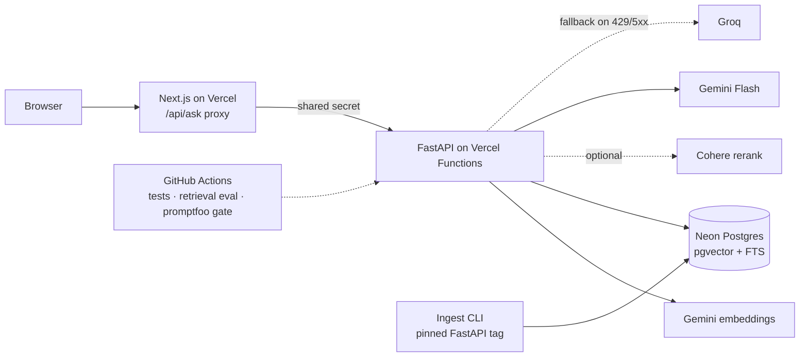

# Grounded

**Cited, schema-validated answers over the FastAPI documentation, with an evaluation harness that blocks quality regressions in CI.**

> 🚧 **Status: Phase 0 (Foundations) done; Phase 1 (ingestion, golden set, dense baseline) next.** Everything below describes the target system. Sections marked
> _TBD_ are filled in only from committed eval results and real measurements, never by hand.

| | |
|---|---|
| Live demo | _TBD (Phase 5)_ |
| Metrics dashboard | _TBD (Phase 8)_ |
| Docs | [Product spec (PRD)](docs/PRD.md) · [Technical design](docs/Tech.md) · [Database](docs/DB.md) · [Rules for contributors & agents](AGENTS.md) |

---

## The problem

Keyword search on documentation sites misses questions phrased differently from the docs. Generic chatbots
answer from stale training data with no sources. Developers need **short, correct answers with code and a link to
the exact section**, and an honest "the docs don't cover this" when that's the case.

Grounded answers questions about [FastAPI](https://fastapi.tiangolo.com) using retrieval-augmented generation over a
frozen snapshot of the official docs, and it **measures** how well it does that.

## What it does

- **Hybrid retrieval:** pgvector dense search + Postgres full-text search, fused with Reciprocal Rank Fusion, optionally re-ranked (Cohere).
- **Structured output:** every answer is a Pydantic-validated object. Native JSON-schema generation, validation, one repair retry, then fallback.
- **Verifiable citations:** each claim cites source labels. The server validates them and maps them to exact `docs-page#section` links. The model never writes URLs.
- **Honest refusals:** `answered | partial | insufficient_context`. Out-of-scope questions are refused, and that behavior is measured.
- **Per-claim confidence:** computed server-side from retrieval signals, with calibration reported.
- **Evals as a gate:** golden set, retrieval metrics (Recall@k, MRR, nDCG), generation metrics (faithfulness, correctness, refusal accuracy) via promptfoo, and a CI gate that fails a PR on regression.
- **Production habits on $0:** provider fallback with circuit breaker, rate limiting, daily budget, caching, request telemetry, p50/p95 latency and shadow cost.

## Architecture



Request flow: validate → rate-limit → cache → embed → hybrid retrieve (dense ∪ FTS → RRF) → rerank → structured
generation → validate/retry/fallback → map citations → score confidence → log → respond.
Details: [docs/Tech.md](docs/Tech.md).

## Evaluation

Golden set: ~30 hand-curated questions (≈25 answerable, ≈5 deliberately unanswerable) with section-level graded
relevance labels. Retrieval metrics are deterministic. Generation metrics use an LLM judge on a *different* provider
than the generator, and the judge's agreement with human labels is published.

| Config | Recall@5 | MRR | nDCG@5 | Faithfulness | Correctness | Refusal acc. | p95 latency | $ / 1k questions* |
|---|---|---|---|---|---|---|---|---|
| no_rag (LLM only) | — | — | — | — | _TBD_ | _TBD_ | _TBD_ | _TBD_ |
| dense | _TBD_ | _TBD_ | _TBD_ | | | | | |
| fts | _TBD_ | _TBD_ | _TBD_ | | | | | |
| hybrid (RRF) | _TBD_ | _TBD_ | _TBD_ | _TBD_ | _TBD_ | _TBD_ | _TBD_ | _TBD_ |
| hybrid + rerank | _TBD_ | _TBD_ | _TBD_ | _TBD_ | _TBD_ | _TBD_ | _TBD_ | _TBD_ |

\* Shadow cost: real token counts × paid list prices (dated in `backend/pricing.toml`); the demo itself runs on free tiers.

Judge–human agreement: _TBD_ · Golden set: `v1`, n = _TBD_ · Numbers come from `eval/baselines/*.json`.

### CI quality gate
- **Every PR:** lint, types, unit + integration tests, retrieval eval vs baseline.
- **PRs labeled `run-eval` and `main`:** full promptfoo generation eval, a PR comment with a diff table, and a blocking gate.
- Runs dominated by free-tier quota errors are reported as **inconclusive**, not as failures.

_Screenshot of a blocked PR: TBD (Phase 2 / Phase 4)._

## Cost and latency

_TBD (Phase 8)._ Will show p50/p95 per stage (embed, retrieval, rerank, LLM), cold-start latency, cache hit rate,
fallback rate and shadow cost per 1k questions, with methodology.

## Failure modes and limitations

Known in advance (expanded with observed examples in Phase 9):
- **Postgres full-text search is not true BM25.** The ablation rows show what lexical search actually contributes.
- **Small golden set.** With ~25 answerable questions, one question ≈ 4 percentage points. Tolerances reflect that.
- **Free-tier constraints:** the first request after idle pays a cold start (serverless function + Neon wake-up); daily quotas can exhaust the demo budget.
- **Frozen corpus:** answers reflect the pinned FastAPI docs version, not the live site.
- **Privacy:** the demo uses free AI API tiers, which may use inputs to improve models. Don't enter personal data.
- **Cohere trial key** is non-production. Serving real users needs a paid key or a local re-ranker.
- **Scheduled housekeeping** (retention SQL) stops if the repo has no activity for 60 days (GitHub policy).

## Tech stack

Python 3.12 · FastAPI · Pydantic v2 · psycopg 3 · PostgreSQL 17 + pgvector (Neon) · Gemini (embeddings + generation)
· Groq (fallback + judge) · Cohere Rerank · promptfoo · pytest · uv · ruff · pyright · Next.js + TypeScript + Tailwind
· GitHub Actions · Vercel (frontend + backend functions)

No LangChain, LlamaIndex, LiteLLM or ORMs. The mechanics are implemented and tested directly.

## Repository layout

```
backend/     FastAPI app, ingest CLI, retrieval, generation, evals (Python package `grounded`)
frontend/    Next.js UI (ask page, metrics dashboard, proxy route handlers)
eval/        golden set, promptfoo config, committed baselines
infra/       docker-compose (pgvector for local dev and CI)
docs/        PRD, technical design, database design
```

## Quickstart (local)

> Requires Docker, [uv](https://docs.astral.sh/uv/), Node.js LTS. `ingest` arrives in Phase 1 and the question UI in Phase 5.
>
> **Windows:** start the API with `grounded serve` (as below), not bare `uvicorn`: psycopg's async driver can't run
> on the Proactor event loop that uvicorn picks there, and `serve` selects a compatible one. Always go through
> `uv run`; the `python` on your PATH doesn't matter.

```bash
cp .env.example .env
```

```bash
docker compose -f infra/docker-compose.yml up -d db
```

```bash
cd backend && uv sync && uv run grounded migrate
```

```bash
uv run grounded ingest --ref 0.141.1 --activate
```

```bash
uv run grounded serve --reload --port 8000
```

```bash
cd frontend && npm ci && npm run dev
```

Run checks and evals:

```bash
uv run ruff check . && uv run ruff format --check . && uv run pyright && uv run pytest
```

```bash
cd frontend && npm run lint && npm run typecheck && npm run build
```

```bash
uv run grounded eval retrieval --config dense --config fts --config hybrid
```

```bash
npx promptfoo@<pinned-version> eval -c eval/promptfoo/promptfooconfig.yaml -j 1
```

## Roadmap

| Phase | Scope | Status |
|---|---|---|
| 0 | Foundations: monorepo, tooling, DB schema, CI skeleton | ✅ done |
| 1 | Ingestion, golden set, dense baseline | ⬜ |
| 2 | Hybrid retrieval (FTS + RRF), CI retrieval gate | ⬜ |
| 3 | `/v1/ask` with structured output, citations, confidence | ⬜ |
| 4 | promptfoo generation eval + CI quality gate | ⬜ |
| 5 | UI, abuse protection, deployment. **MVP** | ⬜ |
| 6 | Re-ranking with measured lift | ⬜ |
| 7 | Provider fallback + circuit breaker | ⬜ |
| 8 | Observability dashboard, cost, calibration | ⬜ |
| 9 | Failure-mode analysis, polish | ⬜ |

Phase details and exit criteria: [docs/PRD.md §9](docs/PRD.md#9-delivery-phases).

## License and attribution

Code: MIT (see [`LICENSE`](LICENSE)).
Corpus: [FastAPI documentation](https://github.com/fastapi/fastapi) at tag `0.141.1` (commit `95f8322`) © Sebastián Ramírez, MIT License. Grounded is an
independent project, not affiliated with or endorsed by FastAPI.
