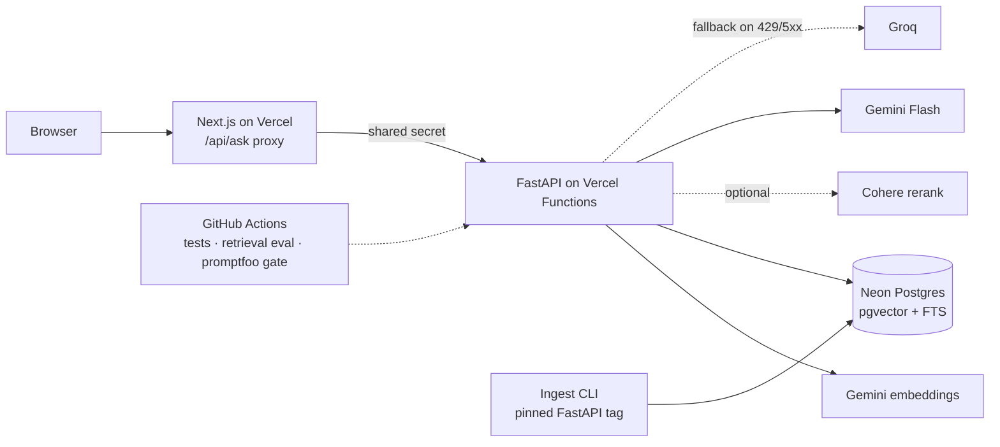

# Grounded

**Cited, schema-validated answers over the FastAPI documentation, with an evaluation harness that blocks quality regressions in CI.**

> 🚧 **Status: Phases 0–4 done (foundations; ingestion, golden set, dense baseline; hybrid retrieval and the CI retrieval gate; `/ask` with structured output, with 30/30 golden questions schema-valid on the real Gemini provider; the promptfoo generation eval with a judge on another provider, a committed baseline and a CI quality gate).** Everything below describes the target system. Sections marked
> _TBD_ are filled in only from committed eval results and real measurements, never by hand.

| | |
|---|---|
| Live demo | _TBD (Phase 5)_ |
| Metrics dashboard | _TBD (Phase 8)_ |
| Docs | [Product spec (PRD)](docs/PRD.md) · [Technical design](docs/Tech.md) · [Database](docs/DB.md) · [Rules for contributors & agents](AGENTS.md) |

---

## The problem

Keyword search on documentation sites misses questions phrased differently from the docs. Generic chatbots
answer from stale training data with no sources. Developers need **short, correct answers with code and a link to
the exact section**, and an honest "the docs don't cover this" when that's the case.

Grounded answers questions about [FastAPI](https://fastapi.tiangolo.com) using retrieval-augmented generation over a
frozen snapshot of the official docs, and it **measures** how well it does that.

## What it does

- **Hybrid retrieval:** pgvector dense search + Postgres full-text search, fused with Reciprocal Rank Fusion, optionally re-ranked (Cohere).
- **Structured output:** every answer is a Pydantic-validated object. Native JSON-schema generation, validation, one repair retry, then fallback.
- **Verifiable citations:** each claim cites source labels. The server validates them and maps them to exact `docs-page#section` links. The model never writes URLs.
- **Honest refusals:** `answered | partial | insufficient_context`. Out-of-scope questions are refused, and that behavior is measured.
- **Per-claim confidence:** computed server-side from retrieval signals, with calibration reported.
- **Evals as a gate:** golden set, retrieval metrics (Recall@k, MRR, nDCG), generation metrics (faithfulness, correctness, refusal accuracy) via promptfoo, and a CI gate that fails a PR on regression.
- **Production habits on $0:** provider fallback with circuit breaker, rate limiting, daily budget, caching, request telemetry, p50/p95 latency and shadow cost.

## Architecture


```mermaid
flowchart LR
    U[Browser] --> FE[Next.js on Vercel<br/>/api/ask proxy]
    FE -- shared secret --> API[FastAPI on Vercel Functions]
    API --> EMB[Gemini embeddings]
    API --> DB[(Neon Postgres<br/>pgvector + FTS)]
    API -. optional .-> RR[Cohere rerank]
    API --> LLM[Gemini Flash]
    API -. "fallback on 429/5xx" .-> LLM2[Groq]
    ING[Ingest CLI<br/>pinned FastAPI tag] --> DB
    CI[GitHub Actions<br/>tests · retrieval eval · promptfoo gate] -.-> API
```

Request flow: validate → rate-limit → cache → embed → hybrid retrieve (dense ∪ FTS → RRF) → rerank → structured
generation → validate/retry/fallback → map citations → score confidence → log → respond.
Details: [docs/Tech.md](docs/Tech.md).

## Evaluation

Golden set: 30 hand-curated questions (25 answerable, 5 deliberately unanswerable) with section-level graded
relevance labels. Retrieval metrics are deterministic. Generation metrics use an LLM judge on a *different* provider
than the generator, and the judge's agreement with human labels is published.

<!-- eval-report:start -->
**Retrieval ablation** (`eval/baselines/retrieval.json`; retrieval only, no LLM): golden set v1 (sha256 8f084817), index 0.141.1@4949e8a3, embedding gemini-embedding-001 (768 dims), git 18fd399, 2026-10-01.

| Config | n | k | Recall@5 | Recall@10 | MRR | nDCG@5 | nDCG@10 |
|---|---:|---:|---:|---:|---:|---:|---:|
| dense | 25 | 20 | 0.760 | 0.920 | 0.714 | 0.698 | 0.752 |
| fts | 25 | 20 | 0.580 | 0.700 | 0.435 | 0.466 | 0.513 |
| hybrid | 25 | 40 | 0.740 | 0.780 | 0.657 | 0.665 | 0.685 |
| *PRD §8 target (hybrid)* |  |  | ≥ 0.80 | — | ≥ 0.60 | ≥ 0.65 | — |
| *hybrid vs target* |  |  | not met | — | met | met | — |

**Generation baseline** (`eval/baselines/generation.json`): golden set v1 (sha256 8f084817), index 0.141.1@4949e8a3, generator gemini / gemini-3.5-flash-lite (prompts: no_rag answer_no_rag_v1@5f725a9d, hybrid answer_v1@08cc49e5), judge groq / openai/gpt-oss-120b (judge_correctness_v1@1bde5fe4, judge_faithfulness_v1@84103412), promptfoo 0.123.1, git 2a7d381, 2026-10-08.

| Metric | no_rag | hybrid | Target (PRD §8) | hybrid vs target |
|---|---:|---:|---:|---:|
| Questions asked | 30 | 30 |  |  |
| Faithfulness | — | 1.000 (n=23) | ≥ 0.90 | met |
| Answer correctness | 0.633 (n=30) | 0.900 (n=30) | ≥ 0.75 | met |
| Refusal accuracy | 0.867 (n=30) | 0.933 (n=30) | ≥ 0.90 | met |
| Schema first-try validity | 1.000 (n=30) | 1.000 (n=30) | ≥ 0.97 | met |
| Citation validity | — | 1.000 (n=30) | — | — |
| Citation precision | — | 0.633 (n=23) | — | — |
| RAG value: correctness(hybrid) - correctness(no_rag) | — | +0.267 (n=30 vs 30) | > 0 | met |
| Latency p50 / p95, ms (warm) | 1769 / 2117 (n=26) | 1901 / 2584 (n=26) |  |  |
| Shadow cost per 1k questions, USD | $1.0064 (n=30) | $1.6855 (n=30) |  |  |

`—`: not applicable or not scored. `n` is the number of questions a metric was scored on (not-applicable and unscored questions are left out). Met / not met compares the unrounded value with the target of PRD §8. `k` is the length of the list a retrieval mode returns (`K_DENSE`, `K_FTS` or `K_FUSED`); MRR runs over it.
<!-- eval-report:end -->

Every number above is pasted from `uv run grounded eval report` (run in `backend/`), which reads only
`eval/baselines/*.json`; a test fails if this block drifts from them, so a baseline PR re-pastes it.
**The generation table is the first baseline (ticket 4.09b):** one full run of the golden set through `no_rag` and
`hybrid`, judged by Groq `openai/gpt-oss-120b`. Faithfulness is claim-level (it grades the claims of an answer, not its
whole text) and is only partly validated by the judge–human agreement below (4.11b). No generation number is written
by hand. Hybrid + rerank joins in Phase 6.
Judge–human agreement: [below](#judge-human-agreement). Golden set: `v1`, 25 answerable questions (retrieval n = 25, one
question = 0.04) and 5 unanswerable ones. Shadow cost is real token counts × paid list prices (dated in
`backend/pricing.toml`); the demo itself runs on free tiers.

### Judge-human agreement

The judge (Groq `openai/gpt-oss-120b`, rubrics `judge_faithfulness_v1@84103412` and `judge_correctness_v1@1bde5fe4`) was
compared with the Author's hand labels on 20 items drawn with a fixed seed from the baseline run above: 10 faithfulness
claims (6 real, 4 synthetic negative controls) and 10 correctness grades (real answers of both configs). The labels were
made on a sheet that shows the evidence and no verdict. How the items were drawn, the procedure and the limits:
[eval/judge_agreement/](eval/judge_agreement/README.md). The labels, the judge's key and the output below are
committed; `uv run grounded eval agreement --labels ../eval/judge_agreement/v1.csv --key ../eval/judge_agreement/v1.key.json`
(in `backend/`) reproduces the output, and a test fails if this block drifts from it. The numbers below are copied from
that output; the sentences around them are the reading.

- **All 20 items: exact agreement 85.0% (17/20), Cohen's kappa 0.808, so the PRD §8 target (0.8) is met by both
  measures.** That is the most flattering view: it pools the labels of two kinds of item and includes the 4 controls,
  which are easy.
- **Faithfulness: 100.0% (10/10), kappa 1.000.** On the 6 real claims the judge and the Author both said `SUPPORTED`;
  on the 4 controls both said `NOT_SUPPORTED`. For the real claims alone kappa is undefined (one label on both sides).
- **Correctness: 70.0% (7/10), kappa 0.538. This is the weak spot, and the target is not met there.** Three grades
  differ (a07, a09, a16); each is one step apart on the three-grade scale, none is `CORRECT` against `INCORRECT`, and the
  judge is stricter than the Author in two and more lenient in one. The kappa is unweighted, so a one-step miss counts like
  a two-step one.
- **Real items only (16): 81.2% (13/16), kappa 0.741, which is below 0.8.** Without the controls the target is met by
  exact agreement and not by kappa. PRD §8 does not say which of the two the 0.8 applies to.
- **Limits.** n = 20, so one item is 5 percentage points. One rater, who also wrote the rubrics. The sample is stratified
  by the judge's own verdict, not random, so this is agreement on this sample and not the judge's accuracy on the run. The
  controls are synthetic: a real claim shown with the sources of another question.

**What it means for the table above.** The judge is not a rubber stamp: it said `NOT_SUPPORTED` for all 4 controls, and the
Author agreed with it on the 6 real claims, which makes the faithfulness **1.000** a little more credible. It does not
validate it. The judge said `SUPPORTED` for all 53 real claims of the run, so the 6 real items can only show agreement on
supported claims; whether the judge catches a *subtly* unsupported real claim (a detail the source does not state) is not
measured at all. Treat 1.000 as "the judge found no unsupported claim", not as a verified zero hallucination rate. The
correctness figures rest on a judge that agrees with the Author on 7 of 10 grades, so a difference between configs of less
than a grade step per question is not a claim. The disagreements, item by item, are in
[eval/judge_agreement/README.md](eval/judge_agreement/README.md#result).

<details>
<summary>The full output of <code>grounded eval agreement</code> (n = 20)</summary>

<!-- agreement-report:start -->
# Judge-human agreement

Sample: seed 411, 20 items from the run 20261008T155539Z-generation.json (sha256 4d571ae1a34b, golden set v1). Judge: groq openai/gpt-oss-120b, rubrics judge_correctness_v1@1bde5fe4, judge_faithfulness_v1@84103412.

| Scope | n | Exact agreement | Cohen's kappa |
|---|---:|---:|---:|
| All items (labels of both kinds pooled) | 20 | 85.0% (17/20) | 0.808 |
| Faithfulness | 10 | 100.0% (10/10) | 1.000 |
| Correctness | 10 | 70.0% (7/10) | 0.538 |
| Real items only (pooled) | 16 | 81.2% (13/16) | 0.741 |
| Faithfulness, real items only | 6 | 100.0% (6/6) | undefined |
| Controls only (synthetic) | 4 | 100.0% (4/4) | undefined |

Kappa of 'Faithfulness, real items only' is undefined: both raters gave every item the label SUPPORTED, so agreement by chance is 100%.
Kappa of 'Controls only (synthetic)' is undefined: both raters gave every item the label NOT_SUPPORTED, so agreement by chance is 100%.

## PRD §8 target

PRD §8 asks for agreement on at least 10 verdicts, 0.8 desired. It does not say whether that is the exact agreement or kappa, so both are shown against it.

| Measure | Value | n | >= 0.8 |
|---|---:|---:|---|
| Exact agreement, all items | 0.850 | 20 | met |
| Cohen's kappa, all items | 0.808 | 20 | met |
| Exact agreement, real items only | 0.812 | 16 | met |
| Cohen's kappa, real items only | 0.741 | 16 | not met |

At least 10 items labeled: yes (n = 20).

## Confusion matrices (rows: human, columns: judge)

### Faithfulness (n = 10)

| human \ judge | SUPPORTED | NOT_SUPPORTED | total |
|---|---:|---:|---:|
| SUPPORTED | 6 | 0 | 6 |
| NOT_SUPPORTED | 0 | 4 | 4 |
| total | 6 | 4 | 10 |

### Correctness (n = 10)

| human \ judge | CORRECT | PARTIALLY_CORRECT | INCORRECT | total |
|---|---:|---:|---:|---:|
| CORRECT | 4 | 1 | 0 | 5 |
| PARTIALLY_CORRECT | 0 | 1 | 1 | 2 |
| INCORRECT | 0 | 1 | 2 | 3 |
| total | 4 | 3 | 3 | 10 |

### Faithfulness, real items only (n = 6)

| human \ judge | SUPPORTED | NOT_SUPPORTED | total |
|---|---:|---:|---:|
| SUPPORTED | 6 | 0 | 6 |
| NOT_SUPPORTED | 0 | 0 | 0 |
| total | 6 | 0 | 6 |

## Disagreements (n = 3 of 20)

- a07 (correctness, real): human INCORRECT, judge PARTIALLY_CORRECT
- a09 (correctness, real): human PARTIALLY_CORRECT, judge INCORRECT
- a16 (correctness, real): human CORRECT, judge PARTIALLY_CORRECT
<!-- agreement-report:end -->

</details>

### Retrieval ablation: reading

**Reading: hybrid did not beat dense here.** That misses the Phase 2 target (hybrid ≥ dense on Recall@5 and MRR).
Per-question evidence from the results file of that run:

- **Recall@5 (−0.02) is within noise**: it moves with one question (q017 and q026 lose it, q019 gains it), and one
  question is worth 0.04.
- **MRR (−0.06) is not clearly noise.** Hybrid ranks the first grade-2 section better on 4 questions and worse on 9.
  Four questions that dense answers at rank 1 drop to rank 2 to 4 (q001, q002, q028, q039).
- **Recall@10 (−0.14) is the largest loss, 4 questions** (q015, q016, q026, q043): dense had a labelled section at
  rank 3 to 10, FTS did not retrieve it, and in the fused list it falls to rank 11 to 20.
- **FTS alone is the weak side** (the lowest Recall@5 and MRR in the table). Its OR query with `ts_rank_cd` is not BM25. For q016 and
  q026 none of the labelled sections is in its top 20. RRF gives both lists the same weight, so a chunk that both
  lists put at a middle rank outranks one that only dense puts first. This is what the rows are consistent with; no
  experiment here isolates it.

Nothing was tuned to improve these numbers: `K_*` and `RRF_K` are the defaults and the lexical query is unchanged.
n = 25, so differences under one question (0.04) are not claims either way.

### CI quality gate
- **Every PR:** lint, types, unit + integration tests, retrieval eval vs baseline (the `retrieval-eval` job: a fresh
  pgvector service, the pinned corpus ingested from cached embeddings, dense/fts/hybrid scored on the golden set, and
  `grounded eval gate` blocking a drop of more than one question's worth on hybrid Recall@5, MRR or nDCG@5). The
  metrics table is in the job summary. A cold embedding cache with no key or quota is reported as an **infrastructure
  failure** (exit code 3), never as a quality result; `warm-cache.yml` seeds the cache.
- **PRs labeled `run-eval`, every push to `main`, and manual runs:** the full promptfoo generation eval (`eval.yml`: the 30
  golden questions through `no_rag` and `hybrid` at concurrency 1, the generator on Gemini and the judge on Groq with
  both model IDs pinned in the workflow, then `grounded eval gate --suite generation` against
  `eval/baselines/generation.json`). Adding the label starts it and every later push to that PR re-runs it; a PR without
  the label never runs it, so a PR that can change answer quality (prompts, retrieval, chunking, context, schemas, model
  IDs) must carry the label (AGENTS.md §7). The numbers it is compared with are the generation block of
  [the report above](#evaluation), which `grounded eval report` prints from the baseline file.
- **Three outcomes**, decided by the gate and by nothing else (promptfoo exits 100 whenever any single assertion fails,
  also in a run that passes, so its exit code is ignored):

  | Outcome | Means | Job |
  |---|---|---|
  | ✅ **pass** | every gated `hybrid` metric (faithfulness, answer correctness, refusal accuracy, schema first-try validity) is at or above its threshold: the baseline minus a tolerance, or a floor | green |
  | ❌ **fail** | a gated metric is below its threshold, or the run cannot be compared with the baseline (another golden set or index, or a gated metric no question could score) | red, with an error annotation |
  | ⚠️ **inconclusive** | more than 20% of a config's cases ended in a provider error (a quota, a 5xx or a timeout, of the generator or of the judge), so nothing of that config is gated and its metrics are shown with `n` | green, with a warning annotation. **Not a pass: re-run once the quota has reset or the provider has recovered** |

  A run that could not even start (the setup failed, promptfoo crashed, the gate had no results to read) is red too and
  says "the eval did not run"; it is never shown as a pass.
- **Reading the PR comment.** One comment, found by a hidden marker and edited on every push, never duplicated. It opens
  with the verdict, then the gate table (config, metric, baseline, current, Δ, threshold, `n`, ✅/❌; `·` means reported
  only), then one line per config (cases, `n`, `n` for faithfulness, provider errors, bad outputs, latency, cost per 1k
  questions), the errors by kind, and a footer with the commit, the models and links to the run and to the downloadable
  report (promptfoo HTML and JSON, the gate's Markdown, the log). `n` is per metric: a question a metric does not apply
  to (faithfulness of a refusal) is left out of it, and a question the judge could not grade is left out too.
- **Free-tier constraints are part of the design.** The judge runs on Groq's free plan (a daily token quota, and 8K tokens
  a minute), the generator on Gemini's, and a full run uses most of the day's Groq quota ([PRD §12](docs/PRD.md#12-assumptions-and-open-items)).
  A cache of LLM replies keeps what was paid for, so an identical re-run is free, and a run that hits a quota stops
  asking and ends `inconclusive`. Most of the first CI runs ended that way (a quota already spent, and spells of
  Gemini 503s); the only run on `main` that gated anything so far passed. Every push to `main` starts a real eval, so
  merges spend quota too.
- **What a red `eval` check does and does not do.** It is not a required status check: the job exists only for labeled
  PRs, so branch protection cannot wait for it, and GitHub still shows the demo PR below as mergeable. The label and the
  review are the enforcement. The gate also sees format and schema regressions better than wording ones: see
  [limitations](#failure-modes-and-limitations).
- A run on `main` is also recorded in the `eval_runs` table for the dashboard (aggregates only). That write is shipped
  **disabled** until the repository variable `EVAL_RECORD_RUNS` is set to `true`.

**Retrieval gate demonstration.** A deliberately broken fusion (the dense term dropped from the RRF score) blocked by the
retrieval gate ([run](https://github.com/Niksa1101/grounded/actions/runs/37453667731), closed PR
[#37](https://github.com/Niksa1101/grounded/pull/37)): hybrid Recall@5 0.74 → 0.58, MRR 0.66 → 0.44, nDCG@5 0.66 → 0.47,
n = 25.


**Generation gate demonstration.** A deliberately degraded `answer_v1`: one line of the prompt changed so that its
`citation_ids` example (`["[c1]", "[c3]"]`) contradicts the schema (`^c[1-9]$`). The generation gate failed it
([run](https://github.com/Niksa1101/grounded/actions/runs/38044085266), closed unmerged PR
[#86](https://github.com/Niksa1101/grounded/pull/86), the
[comment](https://github.com/Niksa1101/grounded/pull/86#issuecomment-6096484617) with the gate table): schema first-try
validity, answer correctness and refusal accuracy of `hybrid` fell below their thresholds, and most generator calls
were bad output after their one retry, with no provider error, so the verdict is a fail and not inconclusive. Weakening
the *instructions* instead (six local attempts) moved no gated metric on this model, which is why the demonstration is a
format mismatch ([PRD §12](docs/PRD.md#12-assumptions-and-open-items)). The inconclusive outcome was seen in real CI runs,
and the report of all three outcomes is pinned by committed fixture tests.

## How confidence is computed

> **Drafted by the agent** while implementing `generation/confidence.py` under the Author's delegation (ticket
> 3.10). It is a placeholder for the Author to rewrite in their own words.

Every claim in an answer carries a confidence in `[0, 1]` that the **server** computes (`score_claims`). The model's
own `self_confidence` is only one weak input, because self-reports are poorly calibrated. For each claim the server
looks at the chunks it cites (only valid labels, each counted once) and builds five components, which the API returns
next to the number:

| Component | Meaning | Default weight (`Settings`) |
|---|---|---|
| `retrieval` | how strongly retrieval ranked the best cited chunk: its dense rank and distance, its FTS rank and score, and its RRF score relative to the top of the list | `CONFIDENCE_W_RETRIEVAL` = 0.40 |
| `agreement` | whether *both* the dense and the lexical search found the best cited chunk (the weaker of their two verdicts, so 0 if only one list found it) | `CONFIDENCE_W_AGREEMENT` = 0.25 |
| `citations` | how many distinct valid sources back the claim: `n / (n + 1)` | `CONFIDENCE_W_CITATIONS` = 0.20 |
| `self_confidence` | what the model said about itself | `CONFIDENCE_W_SELF` = 0.15 (at most 0.6) |
| `rerank` | rerank relevance of the cited chunks, `0` while rerank is off (Phase 6) | `CONFIDENCE_W_RERANK` = 0.0 |

The confidence is the weighted mean of the components (the weights are relative, they need not sum to 1). A claim
with no valid citation is capped at `CONFIDENCE_UNCITED_CAP` (at most 0.2) whatever else it has. With several
citations the best chunk counts for `retrieval` and `agreement` and every extra source raises `citations`, so adding a
citation never lowers the score (an average over the cited chunks would). `min_confidence` of an answer is the lowest
claim confidence. Whether the number is calibrated is measured in Phase 8; until then it is a documented heuristic,
not a probability. Details and the invariants: [docs/Tech.md §9.8](docs/Tech.md).

## Cost and latency

_TBD (Phase 8)._ Will show p50/p95 per stage (embed, retrieval, rerank, LLM), cold-start latency, cache hit rate,
fallback rate and shadow cost per 1k questions, with methodology.

## Failure modes and limitations

Known in advance (expanded with observed examples in Phase 9):
- **Postgres full-text search is not true BM25.** The ablation rows show what lexical search actually contributes.
- **Small golden set.** With ~25 answerable questions, one question ≈ 4 percentage points. Tolerances reflect that.
- **Free-tier constraints:** the first request after idle pays a cold start (serverless function + Neon wake-up); daily quotas can exhaust the demo budget. The same quotas limit the CI eval: a full run uses most of the day's free judge quota, so back-to-back runs end `inconclusive`.
- **The generation gate sees some regressions and not others.** The one degraded prompt that tripped it was a prompt/schema
  format mismatch. Six attempts to weaken the instructions (drop the citation rule, allow outside knowledge, narrow the
  refusal rule, shorten the answer) moved no gated metric on `gemini-3.5-flash-lite`, whose output schema keeps it citing and
  refusing. So the gate is not a substitute for reading a prompt diff, and a different model could behave differently
  ([PRD §12](docs/PRD.md#12-assumptions-and-open-items)).
- **The judge is checked on a small sample.** 20 items, one rater who wrote the rubrics; correctness agreement is the weak
  spot ([above](#judge-human-agreement)). The faithfulness baseline means "the judge found no unsupported claim".
- **Frozen corpus:** answers reflect the pinned FastAPI docs version, not the live site.
- **Privacy:** the demo uses free AI API tiers, which may use inputs to improve models. Don't enter personal data.
- **Cohere trial key** is non-production. Serving real users needs a paid key or a local re-ranker.
- **Scheduled housekeeping** (retention SQL) stops if the repo has no activity for 60 days (GitHub policy).

## Tech stack

Python 3.12 · FastAPI · Pydantic v2 · psycopg 3 · PostgreSQL 17 + pgvector (Neon) · Gemini (embeddings + generation)
· Groq (fallback + judge) · Cohere Rerank · promptfoo · pytest · uv · ruff · pyright · Next.js + TypeScript + Tailwind
· GitHub Actions · Vercel (frontend + backend functions)

No LangChain, LlamaIndex, LiteLLM or ORMs. The mechanics are implemented and tested directly.

## Repository layout

```
backend/     FastAPI app, ingest CLI, retrieval, generation, evals (Python package `grounded`)
frontend/    Next.js UI (ask page, metrics dashboard, proxy route handlers)
eval/        golden set, promptfoo config, committed baselines
infra/       docker-compose (pgvector for local dev and CI)
docs/        PRD, technical design, database design
```

## Quickstart (local)

> Requires Docker, [uv](https://docs.astral.sh/uv/), Node.js LTS. The question UI arrives in Phase 5. The first `ingest` needs `GEMINI_API_KEY` in `.env` (the corpus tag and the embedding model have pinned defaults), and takes two days on the free embedding tier (daily quota); re-running the same command resumes from the cache.
>
> **Windows:** start the API with `grounded serve` (as below), not bare `uvicorn`: psycopg's async driver can't run
> on the Proactor event loop that uvicorn picks there, and `serve` selects a compatible one. Always go through
> `uv run`; the `python` on your PATH doesn't matter.

```bash
cp .env.example .env
```

```bash
docker compose -f infra/docker-compose.yml up -d db
```

```bash
cd backend && uv sync && uv run grounded migrate
```

```bash
uv run grounded ingest --ref 0.141.1 --activate
```

```bash
uv run grounded serve --reload --port 8000
```

```bash
cd frontend && npm ci && npm run dev
```

Run checks and evals:

```bash
uv run ruff check . && uv run ruff format --check . && uv run pyright && uv run pytest
```

```bash
cd frontend && npm run lint && npm run typecheck && npm run build
```

```bash
uv run grounded eval retrieval --config dense --config fts --config hybrid
```

```bash
uv run grounded eval report   # the tables above, from the committed eval/baselines/*.json
```

```bash
export PROMPTFOO_PYTHON="$(uv run --project backend python -c 'import sys; print(sys.executable)')"
npx promptfoo@0.123.1 eval -c eval/promptfoo/promptfooconfig.yaml -j 1 --no-cache -o eval/results/<name>.json
```

The generation eval runs the real pipeline and uses provider quota; the exact command for each shell and for CI, the
smoke-run switches and what the assertions score are in [docs/Tech.md §15.3](docs/Tech.md).

## Roadmap

| Phase | Scope | Status |
|---|---|---|
| 0 | Foundations: monorepo, tooling, DB schema, CI skeleton | ✅ done |
| 1 | Ingestion, golden set, dense baseline | ✅ done |
| 2 | Hybrid retrieval (FTS + RRF), CI retrieval gate | ✅ done |
| 3 | `/v1/ask` with structured output, citations, confidence | ✅ done ([closeout](tickets/phase-3/3.14-closeout.md)) |
| 4 | promptfoo generation eval + CI quality gate | ✅ done ([closeout](tickets/phase-4/4.12-closeout.md)) |
| 5 | UI, abuse protection, deployment. **MVP** | ⬜ |
| 6 | Re-ranking with measured lift | ⬜ |
| 7 | Provider fallback + circuit breaker | ⬜ |
| 8 | Observability dashboard, cost, calibration | ⬜ |
| 9 | Failure-mode analysis, polish | ⬜ |

Phase details and exit criteria: [docs/PRD.md §9](docs/PRD.md#9-delivery-phases).

## License and attribution

Code: MIT (see [`LICENSE`](LICENSE)).
Corpus: [FastAPI documentation](https://github.com/fastapi/fastapi) at tag `0.141.1` (commit `95f8322`) © Sebastián Ramírez, MIT License. Grounded is an
independent project, not affiliated with or endorsed by FastAPI.
