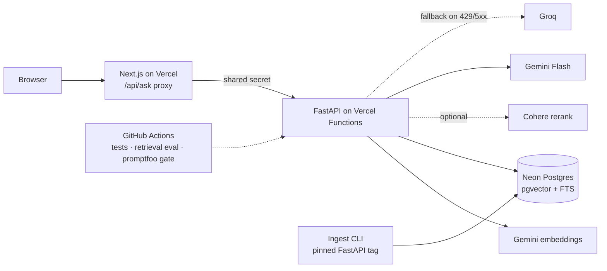
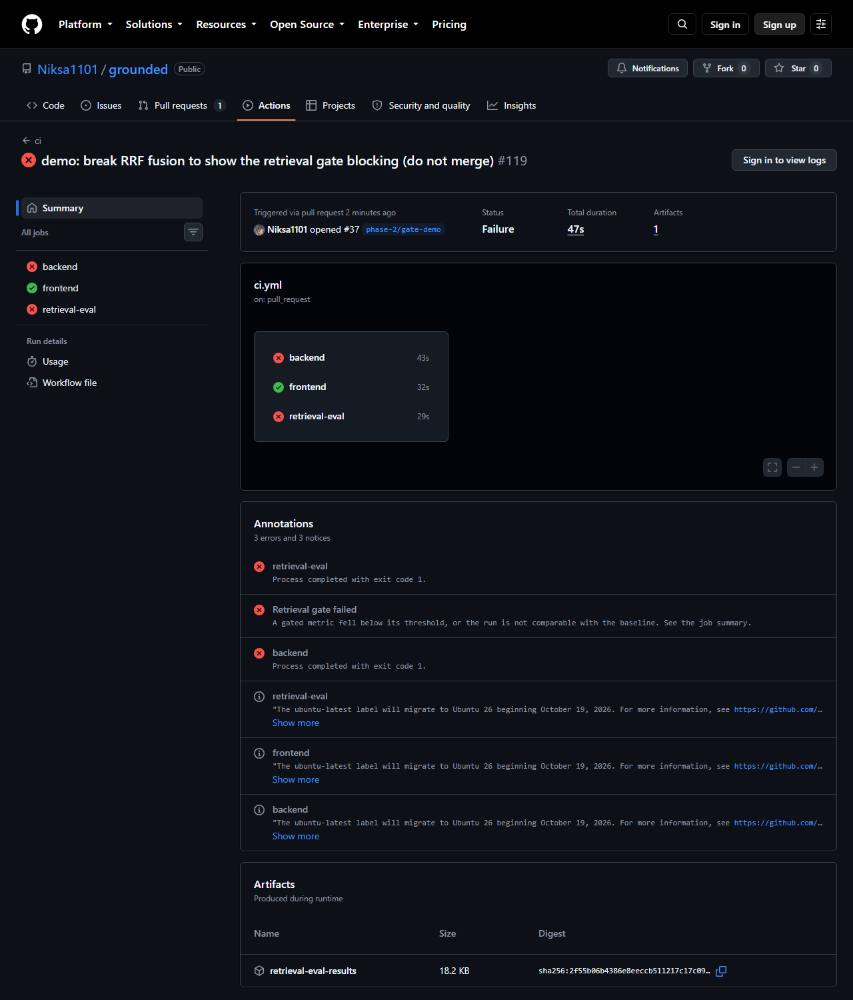

# Grounded

**Cited, schema-validated answers over the FastAPI documentation, with an evaluation harness that blocks quality regressions in CI.**

> 🚧 **Status: Phases 0–3 done (foundations; ingestion, golden set, dense baseline; hybrid retrieval and the CI retrieval gate; `/ask` with structured output, with 30/30 golden questions schema-valid on the real Gemini provider).** Everything below describes the target system. Sections marked
> _TBD_ are filled in only from committed eval results and real measurements, never by hand.

| | |
|---|---|
| Live demo | _TBD (Phase 5)_ |
| Metrics dashboard | _TBD (Phase 8)_ |
| Docs | [Product spec (PRD)](docs/PRD.md) · [Technical design](docs/Tech.md) · [Database](docs/DB.md) · [Rules for contributors & agents](AGENTS.md) |

---

## The problem

Keyword search on documentation sites misses questions phrased differently from the docs. Generic chatbots
answer from stale training data with no sources. Developers need **short, correct answers with code and a link to
the exact section**, and an honest "the docs don't cover this" when that's the case.

Grounded answers questions about [FastAPI](https://fastapi.tiangolo.com) using retrieval-augmented generation over a
frozen snapshot of the official docs, and it **measures** how well it does that.

## What it does

- **Hybrid retrieval:** pgvector dense search + Postgres full-text search, fused with Reciprocal Rank Fusion, optionally re-ranked (Cohere).
- **Structured output:** every answer is a Pydantic-validated object. Native JSON-schema generation, validation, one repair retry, then fallback.
- **Verifiable citations:** each claim cites source labels. The server validates them and maps them to exact `docs-page#section` links. The model never writes URLs.
- **Honest refusals:** `answered | partial | insufficient_context`. Out-of-scope questions are refused, and that behavior is measured.
- **Per-claim confidence:** computed server-side from retrieval signals, with calibration reported.
- **Evals as a gate:** golden set, retrieval metrics (Recall@k, MRR, nDCG), generation metrics (faithfulness, correctness, refusal accuracy) via promptfoo, and a CI gate that fails a PR on regression.
- **Production habits on $0:** provider fallback with circuit breaker, rate limiting, daily budget, caching, request telemetry, p50/p95 latency and shadow cost.

## Architecture


```mermaid
flowchart LR
    U[Browser] --> FE[Next.js on Vercel<br/>/api/ask proxy]
    FE -- shared secret --> API[FastAPI on Vercel Functions]
    API --> EMB[Gemini embeddings]
    API --> DB[(Neon Postgres<br/>pgvector + FTS)]
    API -. optional .-> RR[Cohere rerank]
    API --> LLM[Gemini Flash]
    API -. "fallback on 429/5xx" .-> LLM2[Groq]
    ING[Ingest CLI<br/>pinned FastAPI tag] --> DB
    CI[GitHub Actions<br/>tests · retrieval eval · promptfoo gate] -.-> API
```

Request flow: validate → rate-limit → cache → embed → hybrid retrieve (dense ∪ FTS → RRF) → rerank → structured
generation → validate/retry/fallback → map citations → score confidence → log → respond.
Details: [docs/Tech.md](docs/Tech.md).

## Evaluation

Golden set: 30 hand-curated questions (25 answerable, 5 deliberately unanswerable) with section-level graded
relevance labels. Retrieval metrics are deterministic. Generation metrics use an LLM judge on a *different* provider
than the generator, and the judge's agreement with human labels is published.

| Config | Recall@5 | MRR | nDCG@5 | Faithfulness | Correctness | Refusal acc. | p95 latency | $ / 1k questions* |
|---|---|---|---|---|---|---|---|---|
| no_rag (LLM only) | — | — | — | — | _TBD_ | _TBD_ | _TBD_ | _TBD_ |
| dense | 0.76 | 0.71 | 0.70 | | | | | |
| fts | 0.58 | 0.43 | 0.47 | | | | | |
| hybrid (RRF) | 0.74 | 0.66 | 0.66 | _TBD_ | _TBD_ | _TBD_ | _TBD_ | _TBD_ |
| hybrid + rerank | _TBD_ | _TBD_ | _TBD_ | _TBD_ | _TBD_ | _TBD_ | _TBD_ | _TBD_ |

\* Shadow cost: real token counts × paid list prices (dated in `backend/pricing.toml`); the demo itself runs on free tiers.

Judge–human agreement: _TBD_ · Golden set: `v1`, retrieval n = 25 (answerable questions; 1 question = 0.04) · Numbers come from `eval/baselines/*.json`, rounded to 2 decimals.

### Retrieval ablation

Retrieval only (no LLM), golden set `v1`, index `0.141.1`, n = 25 answerable questions. `k` is the length of the list
the mode returns (`K_DENSE`, `K_FTS` or `K_FUSED`; MRR runs over it). Copied from `eval/baselines/retrieval.json`.

| Config | n | k | Recall@5 | Recall@10 | MRR | nDCG@5 | nDCG@10 |
|---|---|---|---|---|---|---|---|
| dense | 25 | 20 | 0.76 | 0.92 | 0.71 | 0.70 | 0.75 |
| fts | 25 | 20 | 0.58 | 0.70 | 0.43 | 0.47 | 0.51 |
| hybrid (RRF) | 25 | 40 | 0.74 | 0.78 | 0.66 | 0.66 | 0.68 |

**Reading: hybrid did not beat dense here.** That misses the Phase 2 target (hybrid ≥ dense on Recall@5 and MRR).
Per-question evidence from the results file of that run:

- **Recall@5 (−0.02) is within noise**: it moves with one question (q017 and q026 lose it, q019 gains it), and one
  question is worth 0.04.
- **MRR (−0.06) is not clearly noise.** Hybrid ranks the first grade-2 section better on 4 questions and worse on 9.
  Four questions that dense answers at rank 1 drop to rank 2 to 4 (q001, q002, q028, q039).
- **Recall@10 (−0.14) is the largest loss, 4 questions** (q015, q016, q026, q043): dense had a labelled section at
  rank 3 to 10, FTS did not retrieve it, and in the fused list it falls to rank 11 to 20.
- **FTS alone is the weak side** (Recall@5 0.58, MRR 0.43). Its OR query with `ts_rank_cd` is not BM25. For q016 and
  q026 none of the labelled sections is in its top 20. RRF gives both lists the same weight, so a chunk that both
  lists put at a middle rank outranks one that only dense puts first. This is what the rows are consistent with; no
  experiment here isolates it.

Nothing was tuned to improve these numbers: `K_*` and `RRF_K` are the defaults and the lexical query is unchanged.
n = 25, so differences under one question (0.04) are not claims either way.

### CI quality gate
- **Every PR:** lint, types, unit + integration tests, retrieval eval vs baseline (the `retrieval-eval` job: a fresh
  pgvector service, the pinned corpus ingested from cached embeddings, dense/fts/hybrid scored on the golden set, and
  `grounded eval gate` blocking a drop of more than one question's worth on hybrid Recall@5, MRR or nDCG@5). The
  metrics table is in the job summary. A cold embedding cache with no key or quota is reported as an **infrastructure
  failure** (exit code 3), never as a quality result; `warm-cache.yml` seeds the cache.
- **PRs labeled `run-eval` and `main`:** full promptfoo generation eval, a PR comment with a diff table, and a blocking gate.
- Runs dominated by free-tier quota errors are reported as **inconclusive**, not as failures.

A deliberately broken fusion (the dense term dropped from the RRF score) blocked by the retrieval gate
([run](https://github.com/Niksa1101/grounded/actions/runs/37453667731), closed PR
[#37](https://github.com/Niksa1101/grounded/pull/37)): hybrid Recall@5 0.74 → 0.58, MRR 0.66 → 0.44, nDCG@5 0.66 → 0.47,
n = 25.



## How confidence is computed

> **Drafted by the agent** while implementing `generation/confidence.py` under the Author's delegation (ticket
> 3.10). It is a placeholder for the Author to rewrite in their own words.

Every claim in an answer carries a confidence in `[0, 1]` that the **server** computes (`score_claims`). The model's
own `self_confidence` is only one weak input, because self-reports are poorly calibrated. For each claim the server
looks at the chunks it cites (only valid labels, each counted once) and builds five components, which the API returns
next to the number:

| Component | Meaning | Default weight (`Settings`) |
|---|---|---|
| `retrieval` | how strongly retrieval ranked the best cited chunk: its dense rank and distance, its FTS rank and score, and its RRF score relative to the top of the list | `CONFIDENCE_W_RETRIEVAL` = 0.40 |
| `agreement` | whether *both* the dense and the lexical search found the best cited chunk (the weaker of their two verdicts, so 0 if only one list found it) | `CONFIDENCE_W_AGREEMENT` = 0.25 |
| `citations` | how many distinct valid sources back the claim: `n / (n + 1)` | `CONFIDENCE_W_CITATIONS` = 0.20 |
| `self_confidence` | what the model said about itself | `CONFIDENCE_W_SELF` = 0.15 (at most 0.6) |
| `rerank` | rerank relevance of the cited chunks, `0` while rerank is off (Phase 6) | `CONFIDENCE_W_RERANK` = 0.0 |

The confidence is the weighted mean of the components (the weights are relative, they need not sum to 1). A claim
with no valid citation is capped at `CONFIDENCE_UNCITED_CAP` (at most 0.2) whatever else it has. With several
citations the best chunk counts for `retrieval` and `agreement` and every extra source raises `citations`, so adding a
citation never lowers the score (an average over the cited chunks would). `min_confidence` of an answer is the lowest
claim confidence. Whether the number is calibrated is measured in Phase 8; until then it is a documented heuristic,
not a probability. Details and the invariants: [docs/Tech.md §9.8](docs/Tech.md).

## Cost and latency

_TBD (Phase 8)._ Will show p50/p95 per stage (embed, retrieval, rerank, LLM), cold-start latency, cache hit rate,
fallback rate and shadow cost per 1k questions, with methodology.

## Failure modes and limitations

Known in advance (expanded with observed examples in Phase 9):
- **Postgres full-text search is not true BM25.** The ablation rows show what lexical search actually contributes.
- **Small golden set.** With ~25 answerable questions, one question ≈ 4 percentage points. Tolerances reflect that.
- **Free-tier constraints:** the first request after idle pays a cold start (serverless function + Neon wake-up); daily quotas can exhaust the demo budget.
- **Frozen corpus:** answers reflect the pinned FastAPI docs version, not the live site.
- **Privacy:** the demo uses free AI API tiers, which may use inputs to improve models. Don't enter personal data.
- **Cohere trial key** is non-production. Serving real users needs a paid key or a local re-ranker.
- **Scheduled housekeeping** (retention SQL) stops if the repo has no activity for 60 days (GitHub policy).

## Tech stack

Python 3.12 · FastAPI · Pydantic v2 · psycopg 3 · PostgreSQL 17 + pgvector (Neon) · Gemini (embeddings + generation)
· Groq (fallback + judge) · Cohere Rerank · promptfoo · pytest · uv · ruff · pyright · Next.js + TypeScript + Tailwind
· GitHub Actions · Vercel (frontend + backend functions)

No LangChain, LlamaIndex, LiteLLM or ORMs. The mechanics are implemented and tested directly.

## Repository layout

```
backend/     FastAPI app, ingest CLI, retrieval, generation, evals (Python package `grounded`)
frontend/    Next.js UI (ask page, metrics dashboard, proxy route handlers)
eval/        golden set, promptfoo config, committed baselines
infra/       docker-compose (pgvector for local dev and CI)
docs/        PRD, technical design, database design
```

## Quickstart (local)

> Requires Docker, [uv](https://docs.astral.sh/uv/), Node.js LTS. The question UI arrives in Phase 5. The first `ingest` needs `GEMINI_API_KEY` in `.env` (the corpus tag and the embedding model have pinned defaults), and takes two days on the free embedding tier (daily quota); re-running the same command resumes from the cache.
>
> **Windows:** start the API with `grounded serve` (as below), not bare `uvicorn`: psycopg's async driver can't run
> on the Proactor event loop that uvicorn picks there, and `serve` selects a compatible one. Always go through
> `uv run`; the `python` on your PATH doesn't matter.

```bash
cp .env.example .env
```

```bash
docker compose -f infra/docker-compose.yml up -d db
```

```bash
cd backend && uv sync && uv run grounded migrate
```

```bash
uv run grounded ingest --ref 0.141.1 --activate
```

```bash
uv run grounded serve --reload --port 8000
```

```bash
cd frontend && npm ci && npm run dev
```

Run checks and evals:

```bash
uv run ruff check . && uv run ruff format --check . && uv run pyright && uv run pytest
```

```bash
cd frontend && npm run lint && npm run typecheck && npm run build
```

```bash
uv run grounded eval retrieval --config dense --config fts --config hybrid
```

```bash
npx promptfoo@<pinned-version> eval -c eval/promptfoo/promptfooconfig.yaml -j 1
```

## Roadmap

| Phase | Scope | Status |
|---|---|---|
| 0 | Foundations: monorepo, tooling, DB schema, CI skeleton | ✅ done |
| 1 | Ingestion, golden set, dense baseline | ✅ done |
| 2 | Hybrid retrieval (FTS + RRF), CI retrieval gate | ✅ done |
| 3 | `/v1/ask` with structured output, citations, confidence | ✅ done ([closeout](tickets/phase-3/3.14-closeout.md)) |
| 4 | promptfoo generation eval + CI quality gate | ⬜ |
| 5 | UI, abuse protection, deployment. **MVP** | ⬜ |
| 6 | Re-ranking with measured lift | ⬜ |
| 7 | Provider fallback + circuit breaker | ⬜ |
| 8 | Observability dashboard, cost, calibration | ⬜ |
| 9 | Failure-mode analysis, polish | ⬜ |

Phase details and exit criteria: [docs/PRD.md §9](docs/PRD.md#9-delivery-phases).

## License and attribution

Code: MIT (see [`LICENSE`](LICENSE)).
Corpus: [FastAPI documentation](https://github.com/fastapi/fastapi) at tag `0.141.1` (commit `95f8322`) © Sebastián Ramírez, MIT License. Grounded is an
independent project, not affiliated with or endorsed by FastAPI.
